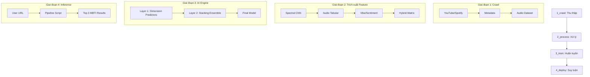

# Audio2MBTI: Toàn cảnh Hệ thống AI & Pipeline Demo

Tài liệu này được thiết kế để trình bày (Demo) với giảng viên và hội đồng. Nội dung tập trung vào kiến trúc hệ thống, luồng xử lý dữ liệu từ audio thô đến khi dự đoán 16 loại tính cách MBTI.

---

## 1. Kiến trúc Hệ thống (Architecture)

Hệ thống được thiết kế theo mô hình **Modular Pipeline** gồm 4 giai đoạn độc lập.

---

## 2. Chi tiết 4 Giai đoạn Pipeline

### Giai đoạn 1: Xây dựng Bộ dữ liệu (1_crawl/)
Mục tiêu là tạo ra bộ dữ liệu có nhãn MBTI từ cộng đồng yêu nhạc.
- **Dữ liệu nguồn:** Danh sách playlist từ Kaggle có nhãn MBTI (E/I, S/N, T/F, J/P).
- **Công nghệ:** `yt-dlp` để tải audio chất lượng cao (WAV 22kHz).
- **Kết quả:** Thư mục audio được phân loại theo 16 nhóm MBTI.

### Giai đoạn 2: Trích xuất Đặc trưng Hybrid (2_process/)
Đây là phần quan trọng nhất, biến âm thanh thành "ngôn ngữ" AI hiểu được.
- **CNN Texture:** Sử dụng Spectrogram (ảnh phổ) đưa qua CNN để lấy 512 đặc trưng trừu tượng.
- **Audio Tabular:** Tempo, Energy, Danceability, Spectral Centroid...
- **NLP & Vibe:** Dịch lời bài hát qua Google Translate và dùng RoBERTa (HuggingFace) để phân tích cảm xúc (Joy, Sadness, Anger...).
- **Hybrid Matrix:** Gộp tất cả thành một vector duy nhất đại diện cho "chữ ký âm nhạc" của playlist.

### Giai đoạn 3: Huấn luyện mô hình Stacking (3_train/)
Thay vì đoán 1 trong 16 lớp trực tiếp, hệ thống dự đoán 4 trục độc lập của MBTI.
- **Thuật toán:** XGBoost với cơ chế **Stacking Ensemble**.
- **Layer 1:** Học các quy luật từng trục (E/I, S/N, T/F, J/P).
- **Layer 2:** Một meta-model học cách kết hợp xác suất của 4 trục để đưa ra dự đoán tổ hợp cuối cùng.
- **Kết quả:** Đạt độ chính xác cao nhất ở chiều E/I (>82%).

### Giai đoạn 4: Demo Thực tế (4_deploy/)
Cung cấp script `test.py` để chạy thử với URL bất kỳ.
- **Đầu vào:** Link YouTube/Spotify/Apple Music.
- **Xử lý:** Chạy lại toàn bộ pipeline trích xuất nhanh (30s audio).
- **Đầu ra:** Top 3 kiểu MBTI phù hợp nhất kèm biểu đồ xác suất chi tiết.

---

## 3. Điểm nhấn Kỹ thuật (Key Highlights)

| Tính năng | Mô tả | Vai trò |
| :--- | :--- | :--- |
| **CNN Embeddings** | Trích xuất từ Tensor ảnh phổ | Hiểu "kết cấu" âm thanh mà con người không nghe thấy |
| **Sentiment NLP** | Phân tích cảm xúc lời bài hát | Kết nối nội dung bài hát với đời sống tinh thần |
| **Stacking Power** | Mô hình 2 tầng | Tận dụng mối tương quan giữa các nhóm tính cách |
| **Data Augmentation** | SpecAugment | Giúp model không bị "học vẹt" (overfitting) |

---

## 4. Cách trình bày khi Demo (3 phút)

1. **Phút 1:** Giới thiệu bài toán và luồng dữ liệu (Sơ đồ Mermaid).
2. **Phút 2:** Giải thích về **Hybrid Features** (Tại sao dùng cả CNN lẫn NLP).
3. **Phút 3:** Chạy thử `test.py` với một playlist thực tế và phân tích kết quả Top 3.

---
*Tài liệu được cập nhật cho phiên bản Pipeline v2.5 - 2026.*
